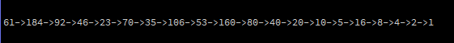
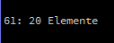

### **Modulo-Operator, boolean, Schleifen**

Schreibe alle Aufgaben in einen Processing Sketch.

Zur Erinnerung:

1) Der Modulo-Operator % ist ein spezieller Operator, mit dem in der Programmierung der Rest bei ganzzahliger Division von zwei Zahlen ermittelt wird. Dividiert man zum Beispiel 13 durch 4, so ist das ganzzahlige Ergebnis 3 (weil 4 in 13 3mal enthalten ist) und es bleibt ein Rest von 1 → 4 x 3 = 12 + 1 = 13 Bei 33 durch 12 wäre das Ergebnis 2 + 9 Rest → 2 x 12 = 24 + 9 = 33

In Processing könnte man diese Beispiele so implementieren:

`int rest;`

`rest = 13 % 4; // rest hat nun den Wert 1`

`rest = 33 % 12; // rest hat nun den Wert 9`

2) Der Datentyp boolean umfasst 2 mögliche Werte: true / false

Processing Beispiele:

`boolean big = true;`

oder

`boolean bigger = isBigger(12,4); //Methode isBigger liefert`

`// einen boolean Wert`

`if (bigger) { //eleganter als if (bigger == true)`

`…`

`}`

### **Aufgaben**

###   
**1\. Ist Teiler:**

Schreibe (und teste wie oben) eine Methode

`boolean istTeiler(int z, int t) {..},`

die überprüft, ob die Zahl t ein Teiler der Zahl z ist. In der setup()-Methode muss die Rückgabe (true/false) überprüft werden und eine entsprechende Ausgabe in der Konsole durchgeführt werden (keine Ausgabe in der Methode selbst)

istTeiler(15,3) → Ausgabe: 3 ist ein Teiler von 15

istTeiler(16,5) → Ausgabe: 5 ist kein Teiler von 16

Die Ausgabe soll hier natürlich in der void setup Methode stattfinden!

### **2\. Alle Teiler:**

Schreibe eine Methode

`void alleTeiler(int z) {..},`

die (mit Hilfe einer Schleife) alle ganzzahligen Teiler der Zahl z in der Konsole ausgibt.

Ausgabebeispiel:

die Zahl 6 hat folgende Teiler: 1, 2, 3, 6

Diese Methode gibt selbst etwas in der Konsole aus!

### **3\. Primzahlen:**

Wir wollen schrittweise eine Methode

`boolean istPrimzahl(int z)`

entwickeln, mit der überprüft werden kann, ob eine Zahl eine Primzahl ist oder nicht. Grundsätzlich gilt: Eine Zahl ist dann eine Primzahl, wenn sie nur durch 1 und sich selbst teilbar ist.

1.  Kopiere die Methode `alleTeiler(int z)` und nenne die Kopie  
    `int zaehleTeiler(int z).   `Ändere die Methode so, dass nicht jeder Teiler ausgegeben wird, sondern stattdessen die gefundenen Teiler gezählt werden und liefere diesen Wert zurück. Überlege und teste, wie viele Teiler diese Methode für eine Primzahl findet.
2.  Optimiere nun diese Methode nach folgenden Überlegungen:
    1.  1 soll als Teiler nicht mehr überprüft werden
    2.  Die Zahl selbst ist als Teiler nicht mehr zu überprüfen
    3.  Die verwendete Schleife kann also angepasst werden … wenn die Zahl selbst als Teiler nicht mehr überprüft werden soll, wie groß ist dann der letzte theoretisch mögliche Teiler vor der Zahl selbst ???
    4.  Welchen Wert liefert die Methode nach dieser Optimierung für eine Primzahl zurück?
3.  Da wir diese Methode nur dazu verwenden wollen, Primzahlen zu erkennen, interessiert uns nur, ob es 0 oder mehr Teiler gibt (aber nicht mehr wie viele!!). Verändere die Methode ein letztes Mal, indem Du den Rückgabetyp auf boolean und den Namen auf istPrimzahl änderst und für 0 Teiler true, sonst false zurücklieferst. Man kann die Schleife sofort abbrechen (return false), wenn ein Teiler gefunden wurde. Wird kein Teiler gefunden, dann ist die Zahl eine Primzahl.

Die Ausgabe soll hier natürlich in der void setup Methode stattfinden!

### **4\. Collatz:**

Eine Collatz-Folge ist eine Zahlenfolge, die, ausgehend von einer beliebigen natürlichen Zahl n > 0, folgendermaßen erzeugt wird:

*   Ist n gerade, so ist das nächste Element n / 2
*   Ist n ungerade, so ist das nächste Element 3 \* n + 1

Für alle Zahlen n > 0 endet diese Folge nach unterschiedlich vielen Schritten bei der Zahl 1 (dies ist allerdings bis heute nicht mathematisch bewiesen worden …)

Schreibe eine Methode

`void collatz (int n) { ... },`

die die Collatz-Folge für die übergebene Zahl ermittelt und ausgibt:

*   Lass nur gültige Werte für n zu!
*   Da die Anzahl der Elemente nicht bekannt ist, verwende idealerweise eine whileSchleife.

Bsp.: collatz(61)

Diese Methode gibt selbst Dinge in der Konsole aus!

Schreibe eine Methode

`int collatzLen (int n) { ... },`

die die Anzahl der Elemente der Collatz Folge für die übergebene Zahl ermittelt und zurückliefert.

Bsp.: collatzLen(61)

Die Ausgabe soll hier natürlich in der void setup Methode stattfinden!