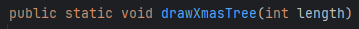
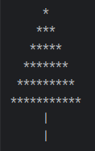
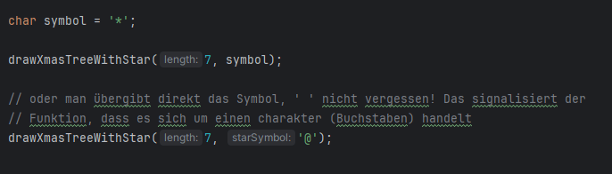
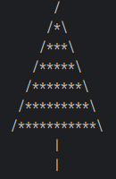

Erstelle ein neues Projekt in Intellij. (Du findest eine Anleitung in den Folien) Definiere außerhalb der main Methode eine Funktion namens 

Diese Funktion soll in ASCII Art einen Weihnachtsbaum zeichnen. Int length soll beim Aufruf der Funktion übergeben werden und definiert die Höhe deines Baumes. Der Stamm sollte dabei gleichbleiben. Du darfst dir aber auch andere Zeichen aussuchen, um den Baum zu zeichnen!

Folgend ein Beispiel eines Weihnachtsbaumes mit der Höhe length = 7

)

Bonusaufgabe:

Schreibe eine weitere Funktion, in der zusätzlich zu length ein Satzzeichen übergeben wird.

Satzzeichen kannst du wie folgt definieren

Bonusaufgabe 2:

Schreibe eine Funktion, die deinen Weihnachtsbaum mit den Zeichen / und \\ umrandet. Wie z.B.:

[UE09_Anleitung](../../../../assets/ue10_anleitung.pptx)